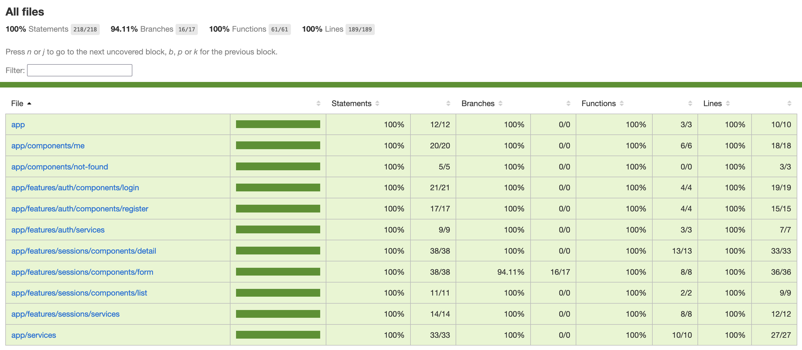
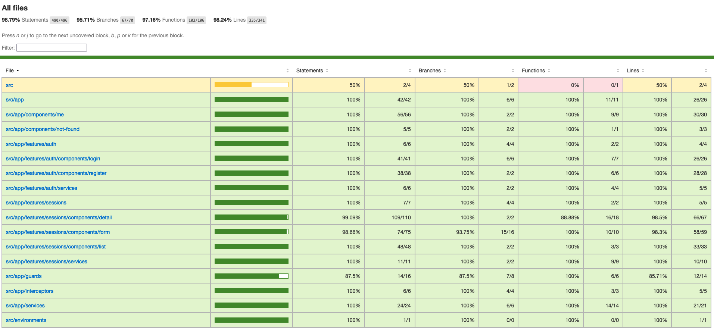
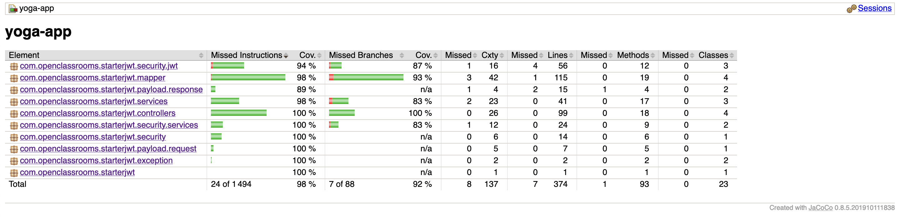

# Yoga App

A complete web application, from Back-end to Front-end, to configure a gym class reservation system !

The Front-End uses :  

The Back-end uses :  

## Getting started

### Clone the project
Clone the project in the directory of your choice :
>git clone https://github.com/CodeByGaetan/YogaApp.git

### MySQL
- Install MySQL on the localhost and enable the service
- Open a terminal in the directory : `/YogaApp/ressources/sql`
- Connect to MySQL with the root user
- Run `SOURCE reset_db.sql;` to create the database tables
- Run `CREATE USER 'TheUsername'@'%' IDENTIFIED BY 'ThePassword';` to create the MySQL user for the app.
The username and password must be the same than in the application.properties file.
- Run `GRANT ALL ON yogadb.* to 'TheUsername'@'%';` to give YogaApp database access to the new user

### Back-end
- Open your IDE (VS Code, Eclipse, etc.) in the directory : `/YogaApp/back`
- Run `mvn spring-boot:run` to launch the back-end in developpment mode
- Or run `mvn package` to build the project and then run `java -jar target/yoga-app-0.0.1-SNAPSHOT.jar` to launch the built package.

### Front-end
- Open your IDE (VS Code, Eclipse, etc.) in the directory : /YogaApp/front
- Run `npm install` to install the dependencies
- Run `npm run start` to start the front-end
- To use the app, navigate to http://localhost:4200/
- By default the admin account is:
    - login: yoga@studio.com  
    - password: test!1234

## Front-end tests
The following commands must be execute from the directory : `/YogaApp/front`

### Unit and Integration tests with Jest

- Launch tests and generate the coverage report :
  >npm run test -- --coverage

- The generated coverage report is located here :  
  >/coverage/jest/lcov-report/index.html

- For following tests on changed files :
  >npm run test:watch -- --coverage

- Coverage report of unit and integration tests :

  

### End-to-end tests with Cypress

- Launch cypress :
  >npm run e2e
- In the cypress window, launch your browser and start the test file : `all.cy.ts`

- Generate the coverage report :
  >npm run e2e:coverage

- The generated coverage report is located here :  
  >/coverage/lcov-report/index.html

- Coverage report of end-to-end tests :

  

## Back-end tests
The following commands must be execute from the directory : `/YogaApp/back`

### Unit and Integration tests with Junit

- Launch tests and generate the coverage report :
  >mvn clean test

- The generated coverage report is located here :  
  >/target/site/jacoco/index.html

- Coverage report of unit and integration tests :

  

## Other ressource

For Postman import the collection :  
> /YogaApp/ressources/postman/yoga.postman_collection.json 

by following [this documentation](https://learning.postman.com/docs/getting-started/importing-and-exporting/importing-and-exporting-overview/).